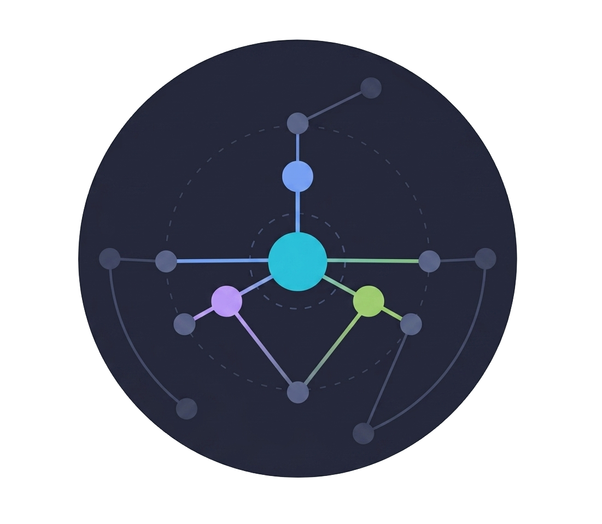

# Serendipity Engine

<p align="center">
  <strong>🌐 Language / 语言：</strong>
  <a href="README.md">🇨🇳 简体中文</a> ·
  🇺🇸 <strong>English</strong>
</p>

<p align="center"></p>

> Graph roaming: an activation engine on top of your personal wiki's backlinks — **ask a point, get a cluster.**
>
> White-box, local, pure-Go zero-dependency. One structural signal, two consumers: **humans** roam for inspiration, **agents** skip the crawl and consume clusters / evidence chains / weight distributions directly.

[](https://github.com/heptaspirit/serendipity-engine/tags) [](LICENSE) [](go.mod) [](go.mod) [](https://github.com/heptaspirit/serendipity-engine/releases) [](https://github.com/heptaspirit/serendipity-engine) [](https://github.com/heptaspirit/serendipity-engine) [](https://github.com/heptaspirit/serendipity-engine) [](README.en.md) [](README.md)

## Features

- **Roam**: query-driven (anchor → explainable cluster of related nodes) · 🎲 random walk (reproducible seed)
- **White-box**: every recommendation carries an activation path, click-to-roam, jump back to the source app
- **Extensible data sources**: the adapter interface accepts any backlink-style note app — Obsidian vault + Orca Note snapshot today (credential data is never read)
- **Queries**: evidence chain between two nodes · structurally similar nodes (shared-neighbor evidence) · potential-link suggestion list (`/api/suggest-links`, for AI review) · export roam results as Markdown
- **Reconciliation**: manual / auto-watch sync for add-edit-delete · pending hint + instant refresh
- **AI-ready**: read-only MCP tools + CLI `--json` structured output
- **Optional**: LLM Wiki profile (`--profile-name llm-wiki`)

## Design Philosophy

1. **Structure × Activation**: the graph structure provides "possibly relevant"; activation provides "relevant right now" — a wiki with only structure is dead; the activation engine makes it alive.
2. **White-box**: every recommendation is explainable, interactive, and can jump back to the source app. No black boxes.
3. **Parsing extracted**: generic syntax is fixed in code; semantic mapping (title/type rules, etc.) lives in YAML profiles — change vaults without changing code.
4. **Restraint by design**: watching uses polling + throttled merging; telemetry only records, never evolves — any "click → weight → result" positive-feedback loop is cut off at the source. A local tool should be stable first.
5. **Security red lines**: credential data is never read; live DBs are snapshotted before reading; personal data never enters git.
6. **Non-goals**: no embedding / GraphRAG / graph databases / LLM-built graphs — the graph must be real, hand-written links (see [docs/positioning.md](docs/positioning.md)).

## Architecture Overview

```
cmd/seren (CLI: index/roam/serve/refresh/profile-detect; no-vault serve → POST /api/vault)
   │ loadSource / parseSource (--db > Orca .db > Obsidian vault)
   ▼
adapter (format translation: Document / Obsidian / Orca / VaultProfile / snapshot)
   │ []*Document
   ▼
graph (in-memory adjacency: Build/Resolve/PPR/Activate/TextSearch)
   ▼
score + roam (normalized fusion + hop-quota / roam pipeline: anchor→spread→exclude→fallback)
   ▼
store (bbolt: docs/links/touch/renames buckets) · sync (reconcile diff) · watch (auto-watch) · web (REST + frontend)
```

Minimal dependencies: the standard library + `gopkg.in/yaml.v3` + `go.etcd.io/bbolt`
(MIT, native Go, zero CGO, storage layer) + `github.com/vsuryav/leiden-go` (MIT,
community detection), no network egress.
Maintainer-facing architecture docs live in `docs/architecture/`.

## Quick Start

```powershell
# Build (Go 1.26+)
go build -o seren.exe ./cmd/seren

# Roam
.\seren.exe roam <vault> "search"                # Obsidian vault
.\seren.exe roam "D:\...\OrcaNote.db" "history"   # Orca DB (.db auto-detected)
.\seren.exe roam <vault> --random --seed 42        # 🎲 random walk (--seed = reproducible)

# Web UI (auto-watch on by default; Obsidian: add --vault-name, Orca: orca-note:// jump)
.\seren.exe serve <vault> --port 8080
.\seren.exe serve --port 8080                     # no-vault start: pick a library in the browser (POST /api/vault)

# Reconcile (sync after add/edit/delete; prints added/updated/deleted)
.\seren.exe refresh <vault> --store <file.bbolt>

# MCP (AI channel, eleven read-only tools; point a stdio MCP client at this)
.\seren.exe mcp <vault> --db <file.bbolt>

# Subcommand help + structured output (CLI triplet)
.\seren.exe help roam          # per-subcommand help (or .\seren.exe roam -h)
.\seren.exe roam <vault> "word" --json   # structured JSON (agent-consumable)
```

LLM Wiki vault profile: `.\seren.exe roam <llm-wiki-vault> "word" --profile-name llm-wiki`.

## AI Access (MCP)

Add the following to `mcpServers` in any MCP client (Codex / DeepSeek Harness (dsh) / Claude Code / Cursor / others):

```json
{
  "mcpServers": {
    "seren": {
      "command": "seren",
      "args": ["mcp", "<vault>", "--db", "<file.bbolt>"]
    }
  }
}
```

Seven read-only tools: `graph.stats / roam / random / relation / node / similar / community` (never writes touch, never triggers refresh — an AI session cannot mutate local state).

## Development

```bash
go build ./cmd/seren   # build
go test ./...          # tests
go vet ./...           # static analysis
```

AI agents: read [AGENTS.md](AGENTS.md) first (orientation / repo map / dev red lines).

## Docs

| Doc | Description |
|---|---|
| [`docs/README.md`](docs/README.md) | Doc navigation (topic-layered index) |
| [`docs/architecture/`](docs/architecture/) | Architecture docs (for maintainers): overview / data model / adapters / engine / sync / web / maintenance / MCP study |
| [`docs/design.md`](docs/design.md) | Core design: graph-roaming mechanics, 4-dimension scoring (PPR + activation + hop quota), stack & product form |
| [`docs/positioning.md`](docs/positioning.md) | Strategic positioning: notes-as-agent-memory "activation layer", LLM Wiki complementarity, boundaries & non-goals |
| [`docs/roadmap.md`](docs/roadmap.md) | Master roadmap: Phase 1 engine core + Web UI polish (self-use) / 2 plugin shells (M2), with dependency chain & status |
| [`docs/plugin-dev-plan.md`](docs/plugin-dev-plan.md) | **Plugin dev plan (M2)**: lifecycle state machine / multi-platform distribution / plugin×AI cooperation. ⚠️ Note: the actual plugin code is developed in separate repos (not in this one); this repo ships the engine core only (the sole shared artifact with plugins is `docs/api-contract.md`) |
| [`docs/frontend.md`](docs/frontend.md) | Frontend plan (Web UI): plugin prep + UI/UX polish spec + test quick-reference |
| [`docs/backend-backlog.md`](docs/backend-backlog.md) | Backend backlog: perf optimizations, similar/export/touch stats, CLI & MCP polish |
| [`docs/api-contract.md`](docs/api-contract.md) | API contract: 15 endpoints + auth + no-vault config (the only shared artifact between the plugin repo and the engine) |
| [`docs/history/`](docs/history/) | Archived decisions/verifications (content absorbed into design/roadmap; full narrative retained) |

## Special Thanks

- **[dsh-mneme](https://github.com/modusensus/dsh-mneme)** — the starting point of the activation-engine philosophy (structure × activation, white-box)
- **[Dinosaur Toolbox](https://github.com/hqweay/orca-hqweay-go)** (Orca Note plugin) — inspiration for the random-walk interaction
- **[leiden-go](https://github.com/vsuryav/leiden-go)** (MIT) — community detection (Leiden)
- **[bbolt](https://github.com/etcd-io/bbolt)** (MIT) — storage layer (etcd-maintained, active BoltDB fork)
- **[graphwizard](https://github.com/intelligrit/graphwizard)** (MIT) — correctness reference for graph algorithms (implementations here are self-written)

## License

MIT License — see [LICENSE](LICENSE).
